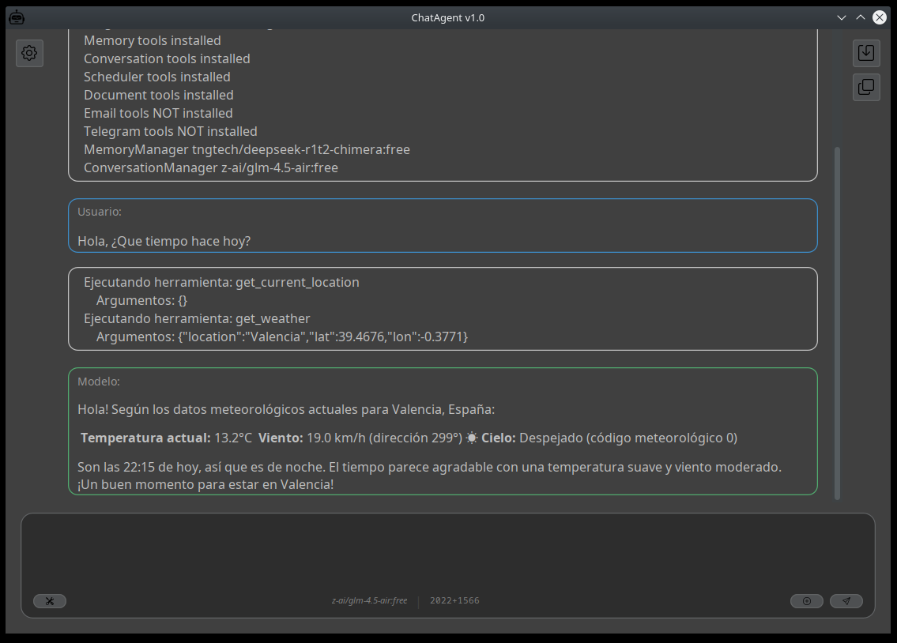

# ChatAgent: Implementación de Referencia para Memoria Híbrida Determinista

> ⚠️ **Estado del Proyecto: Prototipo de Investigación (Alpha)**
>
> Este repositorio contiene el código fuente que acompaña a mi serie de artículos sobre *Arquitectura de Agentes y Memoria Híbrida*.
>
> **No es un producto de consumo final.** Es una **Prueba de Concepto (PoC)** funcional diseñada para validar arquitecturas de IA locales, proactividad y gestión de memoria a largo plazo. Úsalo para estudiar la arquitectura, extraer patrones o como base para experimentos.

## Propósito del Proyecto

El objetivo de este software es demostrar que es posible construir un Agente Autónomo con persistencia real y capacidad de agencia sin depender de infraestructuras complejas en la nube o frameworks pesados.

Implementa los conceptos teóricos de:

*   **Memoria Híbrida Determinista:** Separación de roles entre un `ConversationAgent` (razonamiento) y un `MemoryManager` (consolidación narrativa).
*   **Proactividad Simulada:** Implementación del patrón `pool_event` para permitir al agente reaccionar a estímulos externos (Telegram, Email) dentro del ciclo síncrono del LLM.
*   **Independencia:** Ejecución local (On-Premise) con soporte para LLMs remotos (OpenRouter) o locales (Ollama).

## Interfaz de Usuario

ChatAgent no solo procesa texto; interactúa con su entorno. En la siguiente captura se observa cómo 
el agente, ante una consulta meteorológica, decide de forma autónoma localizar al usuario y consultar 
una API de clima externa antes de responder:



*   **Razonamiento y Herramientas:** Visualización clara de la ejecución de `AgentTools`.
*   **Diseño Moderno:** Interfaz con la estética de los asistentes de IA actuales con soporte para Markdown.
*   **Control de Contexto:** Monitorización en tiempo real de los tokens utilizados (Herramientas + Conversación).

## Stack Tecnológico

La implementación prioriza la ligereza y el control explícito de recursos:

*   **Core:** Java 21 (Uso intensivo de *Virtual Threads*).
*   **Orquestación:** LangChain4j (sin integraciones de alto nivel, uso "bare-metal").
*   **Persistencia:** H2 Database embebida (Modo mixto: Relacional + BLOBs para vectores).
*   **Arquitectura:** Diseño modular basado en *Service Locator* e inyección manual. Sin Spring Boot ni frameworks de DI.
*   **UI:** Swing (Escritorio) y JLine 3 (Consola).

## Documentación y Arquitectura

La documentación técnica detallada de este proyecto reside en un archivo especial dentro de este mismo repositorio:

📄 **[AGENT_CONTEXT.md](./AGENT_CONTEXT.md)**

> **Nota sobre este archivo:**
>
> Este proyecto se desarrolla utilizando una metodología de colaboración con IA. El archivo `AGENT_CONTEXT.md` actúa como el **Contexto Vivo** que utiliza mi asistente para entender el proyecto. Contiene el análisis de la arquitectura, los patrones de diseño y las decisiones técnicas fundamentales.
>
> Si quieres entender cómo funciona este sistema "bajo el capó", ese es el documento que debes leer.

📄 **[DEVELOPMENT_STATUS.md](./DEVELOPMENT_STATUS.md)**

Este proyecto es un organismo vivo que evoluciona junto con mis investigaciones. Para conocer el grado de completitud de cada bloque y la deuda técnica identificada, consultalo.

> **Nota:** Este informe es generado y actualizado de vez en cuando con ayuda de mi asistente de IA tras cada hito relevante, actuando como un registro del progreso y los desafíos pendientes.

📄 **Otra documentacion relevante**

Puedes encontrar interesantes algunos de los articulos que he publicado y para los que este proyecto a sido el patio de pruebas.

*   [¿Qué es un agente?](https://jjdelcerro.github.io/es/blog/que-es-un-agente/)
*   [Agentes de IA y la inyección de observaciones proactivas en clientes de chat](https://jjdelcerro.github.io/es/blog/agentes-de-ia-y-la-inyeccion-de-observaciones-proactivas-en-clientes-de-chat/)

## Características Principales

1.  **Gestión de Memoria:**
    *   **Session:** Memoria de corto plazo.
    *   **Turns:** Persistencia inmutable de interacciones.
    *   **CheckPoints:** Resúmenes narrativos ("El Viaje") generados por IA para compactar la historia sin perder referencias.

2.  **Herramientas (Agency):**
    *   Sistema de archivos (Lectura, escritura, parches *Unified Diff*).
    *   Navegación Web (Búsqueda y extracción con Apache Tika).
    *   Comunicación (Cliente de Email IMAP/SMTP, Bot de Telegram).
    *   Planificador de tareas (Scheduler en lenguaje natural).

3.  **Document Mapper (RAG Estructural):**
    *   Sistema de ingestión de documentos que genera una Tabla de Contenidos estructural antes de vectorizar, permitiendo búsquedas más precisas que el RAG tradicional.

## Inicio Rápido

### Requisitos
*   JDK 21 o superior.
*   Maven 3.8+.

### Construcción
El proyecto utiliza `maven-shade-plugin` para gestionar las dependencias y los SPIs de LangChain4j/Tika.

```bash
mvn clean package
```

### Configuración
El agente necesita configurar los proveedores de LLM. Al arrancar por primera vez, generará los ficheros de configuración en la carpeta `./data`.

1.  Ejecuta el JAR.
2.  Edita `data/settings.properties` o usa la interfaz de configuración integrada.
3.  Define tus API Keys (OpenRouter, OpenAI, o URLs locales de Ollama).

### Ejecución y Primer Arranque

El sistema está diseñado para ser autónomo. No necesitas crear los ficheros de configuración manualmente.

1.  **Ejecuta el JAR:**

    *   **Modo Gráfico (Swing):**

        ```bash
        java -jar target/io.github.jjdelcerro.chatagent.main-1.0.0.jar
        ```

    *   **Modo Consola (JLine):**

        ```bash
        java -jar target/io.github.jjdelcerro.chatagent.main-1.0.0.jar -c
        ```
        
2.  **Asistente de Configuración:**
    Si es la primera vez (o si falta configuración crítica), la aplicación lo detectará y lanzará automáticamente una interfaz (GUI o TUI según el modo) para que introduzcas tus API Keys y selecciones los modelos.

3.  **Reinicio:**
    Una vez guardada la configuración, el agente arrancará con los nuevos parámetros.

    
## Desarrollo y Depuración

Dado que este es un proyecto de investigación, es muy probable que quieras inspeccionar el estado interno del agente (ej: ver el contenido de `Session` o los vectores en memoria) mientras se ejecuta.

Recomiendo lanzar el agente exponiendo el puerto JDWP. He incluido un script de ejemplo (`debug.sh`) para facilitar esto:

```bash
#!/bin/bash
# Lanza el agente permitiendo la conexión remota de un depurador (NetBeans, IntelliJ, VS Code) en el puerto 8765
exec java -agentlib:jdwp=transport=dt_socket,address=8765,server=y,suspend=n -jar target/io.github.jjdelcerro.chatagent.main-1.0.0.jar $@
```

*   **`suspend=n`**: La aplicación arranca inmediatamente sin esperar al debugger.
*   **`address=8765`**: Configura tu IDE para "Remote Java Application" en este puerto.

Esto puede ser especialmente útil por ejemplo para trazar el flujo de decisión dentro de `ConversationService::executeReasoningLoop`.
    
## Estructura de Datos y Personalización (`./data`)

Al arrancar, el agente crea una carpeta `./data` en el directorio de ejecución. Para un investigador o desarrollador, estos son los componentes más relevantes:

### 1. La Base de Conocimiento (Source of Truth)

*   **`memory.mv.db`**: Base de Datos H2 embebida. Contiene la tabla de turnos inmutables, metadatos y los embeddings vectoriales. 
    > *Tip:* Puedes abrir este archivo con cualquier cliente SQL para auditar cómo el agente guarda sus interacciones. Debera estar la aplicacion cerrada para acceder a la BBDD desde herramientas externas.

### 2. Memoria Narrativa (Checkpoints)

*   **`checkpoints/checkpoint-XXX.md`**: Aquí es donde sucede la magia de la consolidación. Son los archivos de "El Viaje" generados por el MemoryManager. Leer estos archivos es la mejor forma de validar cómo el agente comprime la historia sin perder el contexto cognitivo.

### 3. Sala de Máquinas (Prompts)

*   **`prompts/*.md`**: Al primer arranque, el agente despliega los prompts del sistema desde el JAR a esta carpeta. 

    *   `prompt-system-conversationmanager.md`: Define cómo razona el agente.
    *   `prompt-compact-memorymanager.md`: Define el protocolo de escritura de "El Viaje".
    > Puedes editar estos archivos en caliente para ajustar el comportamiento del agente sin necesidad de volver a compilar el código.

### 4. Estado y Configuración

*   **`settings.properties`**: Parámetros de conexión a los proveedores de LLM.
*   **`active_session.json`**: Un snapshot memento de la sesión activa para permitir la recuperación ante cierres inesperados.

### 5. Inspección de datos en vivo (H2 Console)

Para facilitar la auditoría de la memoria del agente, la aplicación inicia automáticamente un servidor web de H2.

*   **URL:** `http://localhost:8082`
*   **JDBC URL:** `jdbc:h2:./data/memory` 
*   **Usuario:** `sa` / **Password:** (vacío)

Desde aquí puedes ejecutar consultas SQL para ver los vectores, los turnos consolidados y los metadatos de las herramientas en tiempo real.

---
*Desarrollado por [Joaquin del Cerro](https://github.com/jjdelcerro) como parte de la investigación sobre arquitecturas de IA.*
