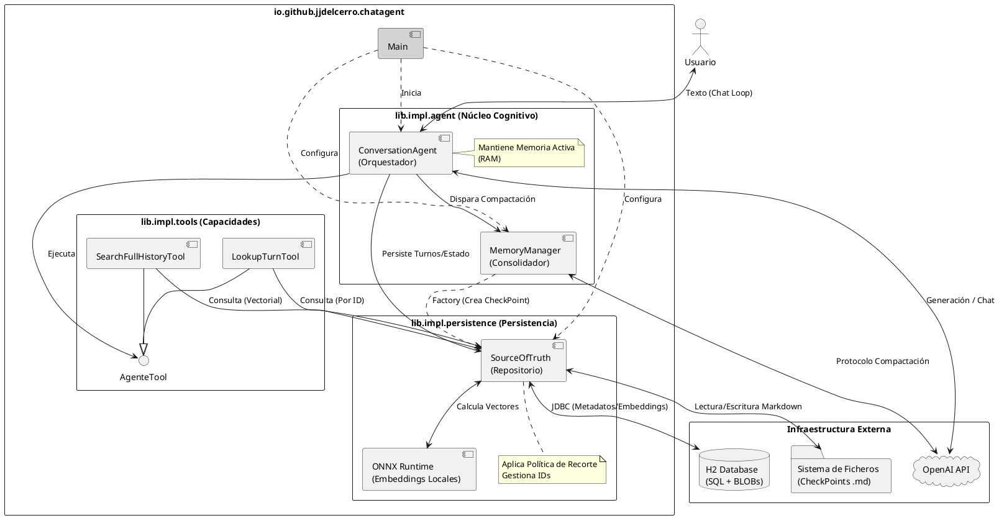

# Documentación Técnica: Agente de Memoria Híbrida Determinista

## 1. Visión General del Proyecto

### 1.1. Objetivo y Filosofía

El objetivo principal de este proyecto es diseñar e implementar un **Agente de Memoria Híbrida Determinista** capaz de sostener conversaciones de larga duración sin sufrir degradación cognitiva ni "olvido catastrófico".

La arquitectura propuesta nace como respuesta a las limitaciones fundamentales de los sistemas conversacionales actuales basados en LLMs (Large Language Models):

1.  **La Ventana de Contexto Finita:** Aunque los modelos aceptan cada vez más tokens, el coste computacional y la pérdida de precisión ("Lost in the Middle") hacen inviable re-inyectar todo el historial en cada turno.
2.  **La Fragilidad del RAG Estándar:** Los sistemas de *Retrieval-Augmented Generation* tradicionales fragmentan la información en "chunks" desconectados, perdiendo el hilo narrativo, la causalidad y la evolución de las ideas a lo largo del tiempo.

#### La metáfora de la mesa de trabajo: olvido útil y recuperación determinista

El diseño propuesto no persigue la retención perfecta e inmutable de toda la información, sino un equilibrio dinámico entre **utilidad presente** y **trazabilidad histórica**. 

Imaginemos una mesa de trabajo física. Tiene espacio limitado. Sobre ella colocamos los documentos, herramientas y notas del proyecto actual. Los proyectos anteriores los guardamos en archivadores etiquetados. 

Cuando cambiamos de proyecto, retiramos elementos de la mesa y los archivamos, conservando quizás solo un resumen o una referencia clave en nuestra libreta de notas. Si meses después necesitamos un detalle de un proyecto antiguo, buscamos en nuestras notas a ver si se "cita" algo de eso en alguna parte. Y si es necesario recuperamos la informacion de los archivarores a partir de las "citas" que teniamos en las notas. Y cuando ya no conservamos informacion en nuestras notas ni en nuestra mesa sobre algo (lo hemos olvidado) y tenemos que volver sobre ello, nos tocara acudir a los archivadores y buscar entre ellos a ver que vimos sobre eso antes.

**Este sistema acepta y regula el olvido:** lo que no es relevante para el presente ocupa menos espacio en la mesa (menor prominencia en el Punto de Guardado) y, eventualmente, puede dejar de mencionarse explícitamente. Pero gracias a las "citas" en nuestras notas se retrasa el olvido teniendo la capacidad de recuperarlo a partir de ellas. El olvido no es catastrófico, sino gestionado.

#### Filosofía de Diseño: La Memoria como un Sistema Operativo

Nuestra filosofía trata la memoria no como un simple log de texto, sino como un sistema activo y estructurado. Se basa en tres pilares fundamentales:

*   **Hibridez (Narrativa + Datos):** El sistema no elige entre resumir o guardar datos crudos; hace ambas cosas. Mantiene un **"Resumen/Viaje"** (narrativa consolidada de alto nivel) para el contexto inmediato del LLM, y una **Base de Conocimiento Inmutable** (datos atómicos y exactos) para la recuperación bajo demanda.
*   **Determinismo sobre Probabilidad:** A diferencia de los sistemas que confían ciegamente en la búsqueda vectorial (probabilística) para recordar, este agente prioriza mecanismos deterministas. Utilizamos identificadores únicos (`ID-1001`) y referencias explícitas (`{cite:ID}`) para garantizar que, cuando el agente recuerda un dato, accede al registro exacto y no a una alucinación o una aproximación borrosa.
*   **Ciclo de Vida de la Información:** La información fluye a través de estados definidos:
    1.  **Memoria Activa (RAM):** Alta fidelidad para el razonamiento inmediato.
    2.  **Persistencia (Source of Truth):** Almacenamiento eficiente y "limpio" en base de datos.
    3.  **Consolidación (Compactación):** Transformación periódica de los eventos recientes en una narrativa histórica ("El Viaje"), liberando espacio cognitivo sin perder la esencia de lo ocurrido.

En resumen, este sistema busca dotar al agente de una **continuidad psicológica**. No se trata solo de que el agente sepa *qué* pasó hace mil turnos, sino que entienda *por qué* pasó y *cómo* eso afecta a las decisiones presentes.


### 1.2. Stack Tecnológico

La implementación del agente se ha construido sobre un stack robusto y minimalista, priorizando la portabilidad, el tipado fuerte y el control explícito sobre el flujo de ejecución.

#### Plataforma Base
*   **Java 21 (LTS):** Se ha elegido la última versión de soporte a largo plazo para beneficiarse de características modernas del lenguaje, la robustez de la JVM y la facilidad de mantenimiento en entornos empresariales.
*   **Apache Maven:** Sistema de gestión de dependencias y construcción. Se utiliza específicamente el **Shade Plugin** configurado con `ServicesResourceTransformer` para generar un "Fat JAR" ejecutable que gestione correctamente los SPIs (Service Provider Interfaces) de los drivers de base de datos y librerías de IA.

#### Núcleo de Inteligencia Artificial (IA)
*   **LangChain4j (0.35.0):** Framework de referencia para IA en Java.
    *   *Decisión Arquitectónica:* A diferencia de la mayoría de implementaciones que utilizan la abstracción de alto nivel (`AiServices`), este proyecto utiliza la **API de Bajo Nivel (Low-Level API)**. Esto es crucial para permitir que el `ConversationAgent` controle manualmente el bucle de ejecución, intercepte las llamadas a herramientas y gestione la persistencia turno a turno, algo imposible con las abstracciones "caja negra".
*   **OpenAI API (deepseek-r1t2-chimera en openrouter):** Modelo de lenguaje subyacente para el razonamiento y la generación de texto.

#### Persistencia y Búsqueda Vectorial
*   **H2 Database (Modo Embebido):** Base de datos relacional SQL ligera.
    *   *Estrategia:* Se utiliza como almacenamiento único ("Source of Truth"). A diferencia de las bases de datos vectoriales especializadas (como Chroma o Pinecone), H2 permite transaccionalidad ACID entre los metadatos y los vectores.
    *   *Almacenamiento:* Los embeddings se almacenan como **BLOBs binarios** (arrays de floats serializados) en lugar de JSON, optimizando drásticamente el espacio y la velocidad de lectura.
*   **ONNX Runtime + All-MiniLM-L6-v2:** Motor de embeddings local.
    *   El cálculo de los vectores se realiza **dentro de la JVM** del agente, eliminando la latencia de red y el coste de llamar a APIs externas (como `text-embedding-3-small`) para la indexación. Esto garantiza privacidad y autonomía en la generación de la memoria.

#### Librerías Auxiliares
*   **Gson:** Para la serialización/deserialización eficiente de los argumentos JSON en la ejecución de herramientas.
*   **SLF4J:** Fachada de logging estándar.
*   **JLine:** Para la gestión avanzada de la entrada/salida en consola (REPL).


## 2. Arquitectura de Software
### 2.1. Estructura de Paquetes

El código fuente se ha organizado siguiendo el principio de **Inversión de Dependencias**, separando claramente los contratos (interfaces) de sus implementaciones concretas. Esto desacopla la lógica cognitiva del agente de los detalles técnicos de almacenamiento o entrada/salida.

La raíz del proyecto es `io.github.jjdelcerro.chatagent`, dividida en los siguientes módulos lógicos:

#### A. Punto de Entrada (`main`)
*   **Paquete:** `io.github.jjdelcerro.chatagent.main`
*   **Responsabilidad:** Contiene la clase `Main`. Es el único punto del sistema donde se conocen todas las implementaciones concretas. Su función es realizar la **Inyección de Dependencias (Wiring)**: configurar la base de datos H2, instanciar el `SourceOfTruth`, configurar el `ConversationAgent` y arrancar el bucle de interacción.

#### B. Capa de Contratos (`lib.*`)
Define las abstracciones con las que trabaja el sistema. Los componentes se comunican entre sí utilizando estas interfaces, sin conocer los detalles de implementación subyacentes.

*   **`lib.persistence`**: Define el modelo de datos y el acceso a la información.
    *   `Turn` y `CheckPoint`: Interfaces que modelan las entidades de memoria.
    *   `SourceOfTruth`: Contrato para el repositorio central de datos.
    *   Excepciones de dominio: `TurnException`, `CheckPointException`.
*   **`lib.tools`**: Define el contrato para las capacidades del agente (`AgenteTool`).
*   **`lib.utils`**: Abstracciones de utilidades transversales, como `ConsoleOutput` para desacoplar la salida por consola.

#### C. Capa de Implementación (`lib.impl.*`)
Contiene la lógica "dura" y las dependencias externas (JDBC, LangChain4j, Gson).

*   **`lib.impl.agent`**: El núcleo cognitivo.
    *   `ConversationAgent`: El orquestador que gestiona el bucle de razonamiento y el estado en memoria activa.
    *   `MemoryManager`: El componente encargado de ejecutar el protocolo de compactación con el LLM.
*   **`lib.impl.persistence`**: La implementación física del almacenamiento.
    *   `SourceOfTruthImpl`: Implementación basada en H2 (SQL) + ONNX (Embeddings locales).
    *   `TurnImpl` y `CheckPointImpl`: Implementaciones concretas que manejan la lógica de inmutabilidad y persistencia en disco/DB.
    *   `Counter`: Utilidad interna para la gestión de IDs autoincrementales seguros.
*   **`lib.impl.tools`**: Implementaciones específicas de las herramientas.
    *   `SearchFullHistoryTool`: Lógica de búsqueda vectorial.
    *   `LookupTurnTool`: Lógica de recuperación determinista.

Esta estructura garantiza que, si en el futuro se desea cambiar la base de datos (ej: de H2 a PostgreSQL) o el mecanismo de salida (ej: de Consola a API REST), solo sea necesario crear nuevas clases en `lib.impl` sin alterar la lógica del agente.


### 2.2. Diagrama de Componentes Conceptual

El siguiente diagrama muestra la arquitectura modular del sistema, destacando la separación entre el núcleo cognitivo, las herramientas y la capa de persistencia, así como las interacciones con sistemas externos.



Detalles del Diagrama

1.  **Orquestación Central (`ConversationAgent`):** Se muestra como el componente que interactúa con el usuario, decide cuándo llamar a OpenAI y gestiona la ejecución de las herramientas a través de la interfaz genérica `AgenteTool`.
2.  **Persistencia Autónoma (`SourceOfTruth`):** Se visualiza cómo este componente encapsula toda la complejidad técnica. Contiene internamente al motor **ONNX** para generar embeddings (sin salir a internet) y coordina la escritura dual hacia la base de datos **H2** y el **Sistema de Ficheros**.
3.  **Inversión de Control en Memoria (`MemoryManager`):** La línea punteada hacia `SourceOfTruth` indica que el gestor de memoria no persiste directamente, sino que solicita al repositorio la creación de los objetos, delegando la responsabilidad del almacenamiento físico.


## 3. Capa de Persistencia (Source of Truth)

El componente `SourceOfTruth` actúa como la piedra angular del sistema. No es un simple DAO (Data Access Object), sino un gestor de estado integral que garantiza la consistencia ACID, la integridad referencial y la indexación semántica de la memoria del agente. Su implementación reside en el paquete `lib.impl.persistence`, ocultando la complejidad detrás de una interfaz limpia definida en `lib.persistence`.

### 3.1. Modelo de Datos

El sistema se sustenta sobre dos entidades fundamentales diseñadas para ser inmutables desde la perspectiva del consumidor, pero gestionadas transaccionalmente por el repositorio.

#### A. La Entidad `Turn` (El Átomo de Memoria)
Representa una unidad indivisible de interacción o pensamiento. Su estructura es plana y versátil, capaz de almacenar desde un simple mensaje de chat hasta la ejecución compleja de una herramienta.

*   **Campos Clave:**
    *   `contenttype`: Define la semántica del turno (`chat`, `tool_execution`, `lookup_turn`). Vital para que el *MemoryManager* sepa cómo narrar el evento.
    *   `embedding`: Vector numérico (`float[]`) que representa el significado semántico del contenido.
    *   `textUser` / `textModel`: Dualidad de la conversación estándar.
    *   `toolCall` / `toolResult`: Datos específicos para la ejecución de funciones.

#### B. La Entidad `CheckPoint` (La Memoria Consolidada)
Implementa un patrón de **Persistencia Híbrida** para optimizar el rendimiento y la legibilidad:
1.  **Metadatos en Base de Datos (SQL):** Se almacenan los rangos de IDs (`turnFirst`, `turnLast`) y el `timestamp`. Esto permite consultas rápidas y ligeras para localizar hitos temporales.
2.  **Contenido en Sistema de Ficheros (.md):** El texto narrativo ("Resumen" y "El Viaje") se almacena como ficheros Markdown físicos en disco.
    *   *Ventaja:* Facilita la depuración y lectura humana (observabilidad) sin necesidad de clientes SQL.
    *   *Lazy Loading:* El contenido del fichero solo se carga en memoria RAM cuando se invoca explícitamente el método `getText()`, manteniendo la huella de memoria del agente baja durante el arranque.

#### C. Gestión de Identidad (Inicialización Retardada)
Para garantizar la integridad, se utiliza un patrón de IDs mutables solo internamente (`package-private`):
*   **Estado Transitorio:** Los objetos se crean en memoria con `ID = -1`.
*   **Estado Persistido:** Al llamar a `SourceOfTruth.add()`, el repositorio consulta su `Counter` interno (sincronizado), asigna un ID real definitivo y bloquea la identidad del objeto.

### 3.2. Estrategia de Almacenamiento Vectorial

A diferencia de las arquitecturas estándar que acoplan una base de datos relacional (PostgreSQL) con una vectorial externa (Pinecone, Chroma), este proyecto implementa una solución **"All-in-One" embebida** de alto rendimiento.

#### H2 Database + BLOBs
Utilizamos H2 en modo embebido para almacenar tanto los datos estructurados como los vectores.
*   **Serialización Binaria:** Los embeddings (arrays de 384 floats) no se guardan como texto JSON, sino como **BLOBs (Binary Large Objects)**. Esto reduce el espacio en disco en un 60-70% y acelera drásticamente la lectura (I/O) al evitar el parsing de texto.
*   **Búsqueda "Full Scan" Optimizada:** Dado el volumen esperado de un agente personal (< 100.000 turnos), no se utilizan índices aproximados (HNSW). Se realiza un escaneo secuencial calculando la **Similitud de Coseno** en memoria. Gracias a las optimizaciones SIMD de la JVM moderna, esta operación es instantánea para la escala del proyecto y garantiza una precisión del 100% (recall perfecto).

#### Motor de Embeddings Local (ONNX)
El cálculo de vectores se realiza dentro de la propia JVM utilizando **ONNX Runtime** y el modelo cuantizado `all-minilm-l6-v2`.
*   **Autonomía:** El agente puede indexar y recordar sin conexión a internet.
*   **Coste Cero:** Elimina la dependencia y el coste por token de APIs de embedding comerciales (como OpenAI).
*   **Latencia:** La vectorización es casi instantánea al no haber overhead de red.

### 3.3. Inversión de Control y Políticas de Escritura

El `SourceOfTruth` asume responsabilidades de "Factoría" y "Gobernador de Datos" para desacoplar al resto del sistema de los detalles técnicos.

#### A. Factoría Transaccional
Componentes como el `MemoryManager` no instancian objetos ni conocen el sistema de ficheros. Solicitan al `SourceOfTruth` la creación de un `CheckPoint`.
*   *Flujo:* `MemoryManager` -> `sourceOfTruth.createCheckPoint(...)`.
*   *Resultado:* El repositorio inyecta las rutas de carpetas correctas y devuelve un objeto listo para ser usado, manteniendo el encapsulamiento.

#### B. Política de "Split State" (Estado Dividido)
Para resolver el problema de herramientas que devuelven resultados masivos (ej: JSON de 10MB), el `SourceOfTruth` aplica una **Política de Recorte** transparente en el momento de la escritura:
1.  **En Memoria (RAM):** El objeto `Turn` mantiene el resultado completo. Esto permite que el LLM analice los datos íntegros durante la sesión activa.
2.  **En Base de Datos (Disco):** El método `add()` detecta si el contenido supera los **2KB**. Si es así, sustituye el contenido real por un JSON de metadatos (`{"status": "truncated", ...}`) antes de hacer el `INSERT`.

Esta estrategia mantiene la base de datos higiénica y ligera a largo plazo, sin sacrificar la capacidad de análisis "en caliente" del agente.


## 4. El Motor Cognitivo (ConversationAgent)

La clase `ConversationAgent` (`lib.impl.agent`) es el cerebro operativo del sistema. No se limita a pasar mensajes entre el usuario y el modelo de lenguaje; actúa como un **Orquestador de Estado (Stateful Orchestrator)** que mantiene la coherencia de la conversación, gestiona la ejecución de herramientas y decide cuándo es el momento de consolidar la memoria.

### 4.1. Ciclo de Vida del Turno (`processTurn`)

El método `processTurn` implementa un bucle de razonamiento reactivo (inspirado en el patrón **ReAct**) que permite al agente realizar múltiples acciones antes de emitir una respuesta final al usuario.

El flujo de ejecución es el siguiente:

1.  **Construcción del Contexto:** Se ensambla el prompt del sistema combinando el `CheckPoint` activo (memoria a largo plazo) con la lista `activeMemory` (memoria de trabajo).
2.  **Inyección del Usuario:** Se añade el mensaje del usuario al contexto.
3.  **Bucle de Razonamiento:**
    *   El LLM recibe el contexto y decide si responder o llamar a una herramienta.
    *   **Si es una Herramienta:**
        *   El agente ejecuta la lógica a través del `toolDispatcher`.
        *   Se genera un nuevo `Turn` con el resultado.
        *   El resultado se inyecta de nuevo al LLM para que continúe su razonamiento.
    *   **Si es Respuesta Final:** Se guarda la respuesta, se muestra al usuario y termina el bucle.

#### Gestión de `pendingUserText`
Para mantener la limpieza en la base de datos, el agente implementa una lógica de **"Input de Usuario Único"**. Se utiliza una variable volátil `pendingUserText` que contiene el texto del usuario solo para el primer turno generado en la cadena de interacción (ya sea una llamada a herramienta o la respuesta final). En los turnos subsiguientes del mismo bucle, este campo se establece a `null`, evitando que una sola pregunta del usuario aparezca duplicada múltiples veces en el historial persistido.

### 4.2. Gestión de Estado "Dividido" (Split State Strategy)

Uno de los desafíos técnicos resueltos en esta arquitectura es el manejo de grandes volúmenes de datos generados por herramientas (ej: análisis de ficheros JSON grandes) sin saturar la base de datos. Para ello, el `ConversationAgent` implementa una estrategia de estado dividido:

*   **Memoria Activa (RAM):** Mantiene una lista `List<Turn> activeMemory` con los objetos íntegros. Si una herramienta devuelve 10KB de texto, el objeto en memoria contiene esos 10KB. Esto es crucial para que el LLM pueda analizar los datos en caliente durante la sesión.
*   **Persistencia (DB):** Al enviar ese mismo turno al `SourceOfTruth`, se aplica la política de recorte definida en la capa de persistencia (ver Sección 3.3).

Esta dualidad garantiza que el agente tenga **máxima fidelidad a corto plazo** (durante el razonamiento) y **máxima eficiencia a largo plazo** (en el almacenamiento histórico).

### 4.3. Estrategia de Compactación

El agente monitoriza continuamente el tamaño de su memoria de trabajo. Cuando `activeMemory` supera el umbral definido (`COMPACTION_THRESHOLD`, por defecto 20 turnos), se dispara el proceso de compactación.

Se utiliza un algoritmo de **Ventana Deslizante (Sliding Window)** para garantizar la continuidad conversacional:

1.  **Segmentación:** La memoria activa se divide en dos mitades.
    *   La mitad más antigua (`0` a `n/2`) se envía al `MemoryManager` para ser consolidada en un nuevo CheckPoint.
    *   La mitad más reciente (`n/2` a `n`) se retiene.
2.  **Consolidación:** Se genera y persiste el nuevo CheckPoint que resume la mitad antigua.
3.  **Transición Suave:** Se limpia la `activeMemory` pero se reinserta inmediatamente la mitad reciente.

**Beneficio:** Esta estrategia evita la "amnesia repentina". Si se vaciara la memoria por completo tras compactar, el agente perdería el contexto inmediato de las últimas frases del usuario. Al mantener una ventana deslizante (overlap), la conversación fluye naturalmente mientras el pasado se sedimenta en segundo plano.


## 5. El Gestor de Memoria (MemoryManager)

El `MemoryManager` (`lib.impl.agent`) es el componente cognitivo especializado en la **memoria a largo plazo**. A diferencia del `ConversationAgent`, que es reactivo y conversacional, el `MemoryManager` actúa como un **cronista determinista**. Su única función es procesar bloques de historia cruda y transformarlos en una narrativa estructurada y coherente.

### 5.1. Protocolo de Compactación

El núcleo de este componente es el **Protocolo de Generación de Puntos de Guardado (v4)**, implementado a través de un *System Prompt* complejo e inmutable. Este protocolo instruye al LLM para operar no como un asistente, sino como un gestor de base de datos narrativa.

#### Características del Protocolo:
*   **Determinismo Estricto:** El modelo se configura con `temperature = 0.0`. Esto es vital para evitar que el LLM "alucine" identificadores de referencia (`ID-1001`) o invente datos que no existen en el historial proporcionado.
*   **Estructura Dual de Salida:**
    1.  **Resumen:** Una visión ejecutiva y factual del estado actual.
    2.  **El Viaje:** Una crónica narrativa detallada que explica *cómo* se llegó al estado actual, preservando la causalidad y las decisiones tomadas.
*   **Modos de Operación:** El gestor detecta automáticamente el contexto:
    *   **Modo 1 (Creación):** Si no existe un `CheckPoint` previo, genera la narrativa desde cero a partir de los turnos.
    *   **Modo 2 (Actualización):** Si existe un historial previo, fusiona el texto del antiguo `CheckPoint` con los nuevos turnos, aplicando una lógica de "Espiral de Contexto" para reinterpretar el pasado a la luz de los nuevos eventos.

#### Formato de Entrada (CSV)
Para maximizar la eficiencia de tokens y la claridad estructural, el historial de turnos se serializa en formato **CSV** antes de enviarse al LLM. Cada línea del CSV incluye:
`code, timestamp, contenttype, text_user, text_thinking, text_model, tool_call, tool_result`

Este formato permite al modelo distinguir claramente entre lo que dijo el usuario, lo que pensó el agente y el resultado técnico de una herramienta, facilitando una narración precisa (ej: *"El agente intentó ejecutar X pero obtuvo un error Y..."*).

### 5.2. Independencia de la Persistencia

Siguiendo el principio de **Inversión de Control**, el `MemoryManager` es agnóstico respecto a *dónde* o *cómo* se guardan los datos.

*   **Responsabilidad Cognitiva:** Su trabajo termina cuando ha generado el texto del nuevo `CheckPoint`.
*   **Delegación de Infraestructura:** No instancia la clase `CheckPoint` directamente ni accede al sistema de ficheros. En su lugar, utiliza el método factoría `sourceOfTruth.createCheckPoint(...)`.

Esto permite que el `MemoryManager` sea puramente lógico. El `SourceOfTruth` es quien inyecta las rutas de carpetas y gestiona los contadores de IDs, devolviendo al gestor un objeto listo para ser usado, pero manteniendo la encapsulación de la capa de persistencia intacta.


## 6. Sistema de Herramientas

El sistema de herramientas (`lib.impl.tools`) dota al agente de capacidad de **introspección**. A diferencia de los agentes convencionales que utilizan herramientas para interactuar con el mundo exterior (calculadoras, búsquedas web), este agente utiliza herramientas para interactuar con su propio "pasado", permitiéndole recuperar información que ha salido de su ventana de contexto inmediata pero que reside en la Base de Conocimiento.

### 6.1. Arquitectura de Tools

Para estandarizar la definición y ejecución de capacidades, se ha definido la interfaz `AgenteTool` (`lib.tools`). Esta abstracción desacopla la lógica de negocio de la herramienta de los detalles del framework de IA.

*   **Definición (`getSpecification`):** Cada herramienta expone su contrato (nombre, descripción, esquema de parámetros) utilizando la clase `ToolSpecification`. Esto permite que el LLM entienda *cuándo* y *cómo* usar la herramienta.
*   **Ejecución (`execute`):** El método recibe los argumentos en formato JSON crudo (String) y devuelve un resultado en String (generalmente JSON).
    *   **Robustez:** Se utilizan clases internas estáticas (DTOs como `SearchArgs`, `LookupArgs`) y la librería **Gson** para parsear y validar los argumentos de forma tipada, evitando errores de runtime si el LLM alucina parámetros incorrectos.

### 6.2. Herramientas Implementadas

Actualmente, el sistema implementa dos herramientas fundamentales para la **Rehidratación de Memoria**:

#### A. `search_full_history` (Recuerdo Asociativo)
*   **Función:** Permite al agente realizar búsquedas semánticas sobre toda su historia. Es el equivalente a "tener una sensación vaga de haber hablado de algo" y buscarlo.
*   **Mecánica:** Delega la consulta en `SourceOfTruth.turnsByText`. Convierte la query en un vector y realiza una búsqueda por similitud de coseno.
*   **Seguridad (Capping):** Implementa un límite estricto de resultados (máximo 50) para evitar desbordar la ventana de contexto si el agente solicita "todo".

#### B. `lookup_turn` (Recuerdo Determinista)
*   **Función:** Permite recuperar un evento específico y su contexto temporal inmediato (turnos anteriores y posteriores). Es clave para la trazabilidad: cuando el agente lee una referencia `{cite:ID-50}` en su Resumen, puede usar esta herramienta para "viajar" a ese momento exacto y leer los detalles completos.
*   **Mecánica:**
    1.  **Normalización de ID:** Parsea el identificador, aceptando tanto formatos enteros (`100`) como referencias textuales (`ID-100`), robusteciendo la interacción con el LLM.
    2.  **Ventana de Contexto:** Calcula el rango de IDs (`[center - window, center + window]`) y delega en `SourceOfTruth.turnsByIds` para recuperar la secuencia cronológica exacta.
    3.  **Resultado:** Devuelve una lista estructurada que el agente interpreta como un "Flashback" narrativo.


## 7. Guía de Uso y Configuración

Esta sección detalla los pasos necesarios para configurar el entorno, compilar el proyecto y ejecutar el agente de memoria híbrida.

### 7.1. Requisitos Previos

Antes de comenzar, asegúrese de tener instalado el siguiente software:

*   **Java Development Kit (JDK) 21:** El proyecto utiliza características modernas del lenguaje (Records, etc.) y requiere estrictamente Java 21 o superior.
*   **Apache Maven 3.8+:** Para la gestión de dependencias y el ciclo de vida de construcción.
*   **API Key:** Se requiere una clave válida con acceso al modelo `deepseek-r1t2-chimera`.

### 7.2. Configuración del Entorno

El sistema no utiliza ficheros de configuración complejos (`.properties` o `.yaml`) para facilitar su despliegue. La configuración sensible se inyecta exclusivamente mediante variables de entorno.

**Variable Obligatoria:**
*   `LLM_API_KEY`: La clave secreta de su la cuenta para acceder al API del LLM (ej: `sk-proj-...`).

### 7.3. Compilación y Empaquetado

El proyecto está configurado para generar un "Fat JAR" (un único archivo ejecutable que contiene todas las dependencias necesarias, incluyendo los drivers de H2 y las librerías de IA).

Ejecute el siguiente comando en la raíz del proyecto:

```bash
mvn clean package
```

Este proceso:
1.  Compilará el código fuente.
2.  Ejecutará el **Maven Shade Plugin**.
3.  Aplicará el `ServicesResourceTransformer` (vital para que funcionen los SPIs de LangChain4j y JDBC).
4.  Generará el artefacto en `target/io.github.jjdelcerro.chatagent.main-1.0.0.jar`.

### 7.4. Ejecución

Para iniciar el agente, asegúrese de tener la variable de entorno definida y ejecute el JAR:

**En Linux / macOS:**
```bash
export LLM_API_KEY="sk-..."
java -jar target/io.github.jjdelcerro.chatagent.main-1.0.0.jar
```

**En Windows (PowerShell):**
```powershell
$env:LLM_API_KEY="sk-..."
java -jar target\io.github.jjdelcerro.chatagent.main-1.0.0.jar
```

### 7.5. Estructura de Datos en Tiempo de Ejecución

Al arrancar, el agente creará automáticamente la siguiente estructura de directorios en la ubicación desde donde se ejecute (Working Directory):

```text
./data/
├── memoria.mv.db       # Base de Datos H2 (Turnos, Vectores y Metadatos)
└── checkpoints/        # Almacenamiento físico de narrativas
    ├── CP-1-(1-20).md  # Texto del primer Punto de Guardado
    ├── CP-2-(21-40).md
    └── ...
```

*   **Persistencia:** Si detiene el agente (escribiendo `salir`) y lo vuelve a arrancar, el sistema detectará la base de datos existente en `./data`, cargará el último CheckPoint y recuperará los turnos no consolidados, permitiendo continuar la conversación exactamente donde la dejó.


## 8. Decisiones de Diseño y Futuras Mejoras

Esta sección documenta las decisiones arquitectónicas clave tomadas durante el desarrollo del prototipo y propone una hoja de ruta para la evolución del sistema hacia un entorno productivo.

### 8.1. Justificación de Decisiones Técnicas

#### A. H2 y Búsqueda por "Fuerza Bruta" vs. VectorDB Dedicada
Se optó por utilizar H2 con un escaneo secuencial ("Full Scan") para la búsqueda vectorial en lugar de integrar una base de datos vectorial especializada (como Chroma o Qdrant).
*   **Motivo:** Para una memoria personal de agente (estimada en < 50.000 turnos), la sobrecarga de mantener un servicio externo es innecesaria. Las operaciones vectoriales modernas (SIMD) en la JVM permiten comparar decenas de miles de vectores en milisegundos.
*   **Beneficio:** Simplificación drástica del despliegue (un solo fichero JAR + una carpeta de datos) y consistencia transaccional (ACID) entre el texto y su vector, algo difícil de lograr con sistemas distribuidos.

#### B. Orquestación Manual vs. `AiServices`
Se descartó el uso de las abstracciones de alto nivel de LangChain4j (`AiServices`, `@Tool`) en favor de la API de bajo nivel.
*   **Motivo:** La arquitectura requería un control granular sobre el ciclo de vida del dato. Necesitábamos interceptar la salida de las herramientas para aplicar la política de recorte ("Split State") y decidir momento a momento cuándo persistir. Las abstracciones de alto nivel ocultan este flujo, haciendo imposible la implementación de la "Memoria Híbrida" con la precisión requerida.

#### C. Embeddings Locales (ONNX)
Se integró el modelo `all-minilm-l6-v2` mediante ONNX Runtime dentro del proceso Java.
*   **Motivo:** Desacoplar la capacidad de "recordar" de la disponibilidad de la red y evitar costes recurrentes por indexación. Esto hace que la base de conocimiento sea autónoma y privada por defecto.

### 8.2. Limitaciones Actuales

*   **Escalabilidad de Búsqueda:** Aunque el "Full Scan" es rápido para miles de registros, su complejidad es O(N). Si la memoria crece hacia los millones de turnos, la latencia de recuperación se degradará linealmente.
*   **Compactación Síncrona:** Actualmente, cuando se dispara la compactación, el usuario debe esperar a que el `MemoryManager` (LLM) genere el resumen. Esto introduce una pausa perceptible en la conversación cada 20 turnos.
*   **Monohilo / Monousuario:** El sistema de contadores y la gestión de archivos están diseñados para una ejecución local de un solo agente. No es seguro para entornos concurrentes o multi-usuario sin refactorización.

### 8.3. Futuras Mejoras (Roadmap)

#### Fase 1: Optimización de Rendimiento
*   **Compactación Asíncrona:** Mover la lógica de `MemoryManager.compact()` a un **Virtual Thread** de Java 21. El agente podría seguir conversando utilizando la memoria activa mientras el proceso de consolidación ocurre en segundo plano, intercambiando el CheckPoint cuando esté listo.
*   **Índices HNSW:** Si el volumen de datos crece, sustituir el escaneo lineal por un índice de "Mundo Pequeño Jerárquico Navegable" (HNSW) en memoria para mantener la búsqueda en tiempos sub-milisegundo.

#### Fase 2: Robustez Empresarial
*   **Migración a PostgreSQL (pgvector):** Para entornos de producción, sustituir la implementación `SourceOfTruthImpl` basada en H2 por una basada en PostgreSQL con la extensión `pgvector`. Esto resolvería la escalabilidad y permitiría acceso concurrente.
*   **Recuperación de Errores en Tools:** Implementar un mecanismo de reintento o "auto-corrección" si una herramienta falla, permitiendo que el LLM reciba el error y decida si probar otros parámetros.

